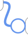
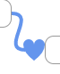

# react-xarrows

## introduction

Draw arrows between components in React!

[](https://github.com/Eliav2/react-xarrows)
[](https://www.npmjs.com/package/react-xarrows)
[](https://github.com/Eliav2/react-xarrows/issues)
[](https://github.com/Eliav2/react-xarrows/blob/master/LICENSE)

### Main features

- Connect arrows/lines between components just by passing an id or ref!
- Super simple API yet fully customizable usage!
- Smart and Intuitive look and behavior!
- Smart React lifecycle, and cached parsed props for efficiency!

liked my work? star [this repo](https://github.com/Eliav2/react-xarrows).

reallyy liked my work? [buy me a coffee](https://www.paypal.com/donate?hosted_button_id=CRQ343F9VTRS8)!  
this project needs funding to stay open source and free :blush:

## installation

with npm `npm install react-xarrows`.
(or `yarn add react-xarrows`)

## Examples

#### Demos

[see here!](https://codesandbox.io/embed/github/Eliav2/react-xarrows/tree/master/examples?fontsize=14&hidenavigation=1&theme=dark)
codebox of few examples(in this repo at [/examples](./examples)).


see this interactive example: <https://lwwwp.csb.app/CustomizeArrow>

[comment]: <> (![react-xarrows-v1 6]&#40;https://user-images.githubusercontent.com/47307889/113949468-070f1c80-9818-11eb-90e6-ddc6d814b912.gif&#41;)


### simple example:

```jsx
import React, {useRef} from "react";
import Xarrow from "react-xarrows";

const boxStyle = {border: "grey solid 2px", borderRadius: "10px", padding: "5px"};

function SimpleExample() {
    const box1Ref = useRef(null);
    return (
        <div style={{display: "flex", justifyContent: "space-evenly", width: "100%"}}>
            <div ref={box1Ref} style={boxStyle}>hey</div>
            <p id="elem2" style={boxStyle}>hey2</p>
            <Xarrow
                start={box1Ref} //can be react ref
                end="elem2" //or an id
            />
        </div>
    );
}

export default SimpleExample;
```

### V2 example

in order to invoke updates on xarrows wrap your arrows and connceted elements with `Xwrapper`, and consume `useXarrow`
on connected elements.

```jsx
import React from 'react';
import Xarrow, {useXarrow, Xwrapper} from 'react-xarrows';
import Draggable from 'react-draggable';

const boxStyle = {border: 'grey solid 2px', borderRadius: '10px', padding: '5px'};

const DraggableBox = ({id}) => {
    const updateXarrow = useXarrow();
    return (
        <Draggable onDrag={updateXarrow} onStop={updateXarrow}>
            <div id={id} style={boxStyle}>
                {id}
            </div>
        </Draggable>
    );
};

export function V2Example() {
    return (
        <div style={{display: 'flex', justifyContent: 'space-evenly', width: '100%'}}>
            <Xwrapper>
                <DraggableBox id={'elem1'}/>
                <DraggableBox id={'elem2'}/>
                <Xarrow start={'elem1'} end="elem2"/>
            </Xwrapper>
        </div>
    );
}
```

<details>

<summary markdown='span'>another example</summary>

```tsx
import React from 'react';
import Xarrow, {useXarrow, xarrowPropsType, Xwrapper} from 'react-xarrows';
import Draggable from 'react-draggable';

const boxStyle = {
    border: '1px #999 solid',
    borderRadius: '10px',
    textAlign: 'center',
    width: '100px',
    height: '30px',
    color: 'black',
    alignItems: 'center',
    display: 'flex',
    justifyContent: 'center',
} as const;

const canvasStyle = {
    width: '100%',
    height: '100vh',
    background: 'white',
    overflow: 'auto',
    display: 'flex',
    color: 'black',
} as const;

const DraggableBox = ({box}) => {
    const updateXarrow = useXarrow();
    return (
        <Draggable onDrag={updateXarrow} onStop={updateXarrow}>
            <div id={box.id} style={{...boxStyle, position: 'absolute', left: box.x, top: box.y}}>
                {box.id}
            </div>
        </Draggable>
    );
};

const SimpleTemplate = () => {
    const box = {id: 'box1', x: 20, y: 20};
    const box2 = {id: 'box2', x: 320, y: 120};
    const box3 = {id: 'box3', x: 50, y: 150};
    const box4 = {id: 'box4', x: 320, y: 220};
    return (
        <div style={canvasStyle} id="canvas">
            <Xwrapper>
                <DraggableBox box={box}/>
                <DraggableBox box={box2}/>
                <Xarrow start={'box1'} end={'box2'}/>
                <Xarrow start={'box1'} end={'box2'} endAnchor={'top'}/>
                <Xarrow start={'box1'} end={'box2'} startAnchor={'bottom'}/>
            </Xwrapper>
            <Xwrapper>
                <DraggableBox box={box3}/>
                <DraggableBox box={box4}/>
                <Xarrow start={'box3'} end={'box4'}/>
            </Xwrapper>
        </div>
    );
};
```

(will render this)


</details>

## Usage

react-xarrow v2.0 released! no need to trigger render on parents anymore!  
react-xarrows will smartly trigger updates on relevant elements! use `Xwrapper` and `useXarrow` hook to achieve
selective rendering!

please note that v2.0.0 is not working using react [StrictMode](https://reactjs.org/docs/strict-mode.html). to fix
update to v2.0.1.

##### breaking changes

V2.0 introduced some breaking changes, mainly related to properties naming. see [CHANGELOG.md](./CHANGELOG.md) for
details.

#### useXarrow

```jsx
import {useXarrow} from "react-xarrow"

const YourComponent = ({id, ...props}) => {
    const updateXarrow = useXarrow()
    //...
    return (
        <div id={id}>
            ...
        </div>
    )

}
```

#### Xwrapper

```jsx
const YourApp = () => {
    return (
        // ...
        <Xwrapper>
            <YourComponent id={'comp1'}/>
            <YourComponent id={'comp2'}/>
            <Xarrow start={'comp1'} end={'comp2'}/>
        </Xwrapper>
        // ...
    )
}
```

each time component calling useXarrow hook renders also the xarrows inside the wrapping Xwrapper wrapper will render.
receiving `updateXarrow` is optional. use this function only if you want to trigger a render different phase from
rendering(like click or drag event).

### API

to see full typescript definition see [types.ts](src/types.ts) file.

here's a summary of the all the available props:

**Properties**|**Description**|**default value**|**type**
:-----:|:-----:|:-----:|:-----:
[start](#refs)|ref to start element|none(Required!)|string/ReactRef
[end](#refs)|ref to end element|none(Required!)|string/ReactRef
[startAnchor](#anchors)|from which side the arrow should start from start element| 'auto'|string/object/array
[endAnchor](#anchors)|at which side the arrow should end at end element| 'auto'|string/object/array
[labels](#labels)|optional labels| null|string/array
[color](#colors)|color of Xarrow(all parts)| 'CornflowerBlue'|string
[lineColor](#colors)|color of the line| null|string
[headColor](#colors)|color of the head| null|string
[tailColor](#colors)|color of the tail| null|string
[strokeWidth](#widths)|thickness of Xarrow(all parts)|4|number
[headSize](#widths)|thickness of head(relative to strokeWidth)|6|number
[tailSize](#widths)|thickness of tail(relative to strokeWidth)|6|number
[path](#path)|path drawing style| 'smooth'|string
[curveness](#curveness)|how much the line curveness when path='smooth'| 0.8|number
[gridBreak](#gridBreak)|where the line breaks in path='grid'| "50%" | string
[dashness](#dashness)|should the line be dashed| false|boolean/object
[showHead](#shows)|show the arrow head?| true|boolean
[showTail](#shows)|show the arrow tail?| false|boolean
[showXarrow](#shows)|show Xarrow?| true|boolean
[animateDrawing](#animateDrawing)|animate drawing when arrow mounts?| false|boolean/object
[headShape](#customsvgs)|shape of the arrow head| 'arrow1'|string/object
[tailShape](#customsvgs)|shape of the arrow tail|'arrow1'|string/object
zIndex|[zIndex](https://developer.mozilla.org/en-US/docs/Web/CSS/z-index) - Overlapping elements with a larger z-index cover those with a smaller one|0|number

<details>

<summary markdown='span'>Advanced Props</summary>

[see details](#advancedCustom)

**Properties**|**Description**|**default value**|**type**
:-----:|:-----:|:-----:|:-----:
passProps|properties which will be pased to arrowBody,arrowHead,arrowTail| {}|object
SVGcanvasProps|properties which will be passed to svgCanvas| {}|object
arrowBodyProps|properties which will be passed to arrowBody| {}|object
arrowHeadProps|properties which will be passed to arrowHead| {}|object
arrowTailProps|properties which will be passed to arrowTail| {}|object
divContainerProps|properties which will be passed to divContainer| {}|object
SVGcanvasStyle|style properties which will be passed svgCanvas|0|object
divContainerStyle|style properties which will be passed divContainer| false|object
_extendSVGcanvas|extend svgCanas at all sides|0|number
_debug|show debug elements|0|boolean
_cpx1Offset|offset control point 1 x|0|number
_cpy1Offset|offset control point 1 y|0|number
_cpx2Offset|offset control point 2 x|0|number
_cpy2Offset|offset control point 2 x|0|number

</details>

##### API flexibility

This API built in such way that most props can accept different types. you can keep things simple or provide more custom
props for more custom behavior(see [`startAnchor`](#anchors) good example). <br/>
explore typescript for detailed descriptions of what type excepts every prop.

## Properties

This documentation is examples driven.\
The examples sorted from the most common use case to the most custom one.

<a name="refs"></a>

<details>

<summary markdown='span'> 'start' and 'end' </summary>

_required_\
can be a reference to a react ref to html element or string - an id of a DOM element.

examples:

- `start="myid"` - `myid` is id of a dom element.
- `start={myRef}` -  `myRef` is a react ref.

</details>

<a name="anchors"></a>

<details>

<summary markdown='span'> 'startAnchor' and 'endAnchor' </summary>

specify what anchors are allowed. can be a string/object/array.

type:

```typescript
export type anchorType = anchorPositionType | anchorCustomPositionType;
```

#### simple usage:

type:

```typescript
export const tAnchorEdge = ['middle', 'left', 'right', 'top', 'bottom', 'auto'] as const;
export type anchorPositionType = typeof tAnchorEdge[number];
```

one of `"auto" | "middle" | "left" | "right" | "top" | "bottom"`
`auto` will choose automatically the path with the smallest length.

example:

- `endAnchor="middle"` will set the anchor of the end of the line to the middle of the end element.
- `endAnchor="auto"` choose the closest anchor.
- `endAnchor="left"` connect to the left.

#### custom usage:

type:

```typescript
export type anchorCustomPositionType = {
    position: anchorPositionType;
    offset: { x?: number; y?: number };
};
```

example:

- `endAnchor= { position: "auto", offset: { x: 20 } }` will choose automatic anchoring for end anchor but will offset it
  20 pixels to the right after normal positioning.

if list is provided - the minimal length anchors will be chosen from the list. example:

- `endAnchor= ["right", {position: "left", offset: {y: -10}}]` only right and left anchors will be allowed for
  endAnchor, and if the left side connected then it will be offset 10 pixels up.

</details>

<a name="labels"></a>

<details>

<summary markdown='span'> labels </summary>

you can place up to 3 labels. see examples

- ```labels="middleLabel"``` - middle label
- ```labels=<div style={{ fontSize: "1.3em", fontFamily: "fantasy", fontStyle: "italic" }}>styled middle label</div>```
    - custom middle label
- ```labels={{ start:"I'm start label",middle: "middleLabel",end:<div style={{ fontSize: "1.3em", fontFamily: "fantasy", fontStyle: "italic" }}>big end label</div> }}```
  start and middle label and custom end label

</details>

<a name="colors"></a>

<details>

<summary markdown='span'> color,lineColor and headColor and tailColor </summary>


`color` defines color to the entire arrow. lineColor,headColor and tailColor will override color specifically for
line,tail or head. examples:

- `color="red"` will change the color of the arrow to red(body and head).
- `headColor="red"` will change only the color of the head to red.
- `tailColor="red"` will change only the color of the tail to red.
- `lineColor="red"` will change only the color of the body to red.

</details>

<a name="widths"></a>

<details>

<summary markdown='span'>strokeWidth and headSize and tailSize</summary>

strokeWidth defines the thickness of the entire arrow. headSize and tailSize defines how big will be the head or tail
relative to the strokeWidth. examples:

- `strokeWidth={15}` will make the arrow more thick(body and head).
- `headSize={15}` will make the head of the arrow more thick(relative to strokeWidth as well).
- `tailSize={15}` will make arrow's tail thicker.

</details>

<a name="path"></a>

<details>

<summary markdown='span'>path</summary>

`path` can be one of: `"smooth" | "grid" | "straight"`, and it controls the path arrow is drawn, exactly how their name
suggest. examples:

- `path={"grid"}` will draw the line in sharp curves(90 degrees) like grid.

</details>

<a name="curveness"></a>

<details>

<summary markdown='span'>curveness</summary>

defines how much the lines curve. makes a difference only in `path='smooth'`. examples:

- `curveness={false}` will make the line straight without curves(exactly like path='straight').
- `curveness={true}` will choose default values of curveness.
- `curveness={2}` will make Xarrow extra curved.

</details>

<a name="gridBreak"></a>

<details>

<summary markdown='span'>gridBreak</summary>

defines where the line will break when `path='grid'`.

examples:

- `gridBreak='20%'` the line would break closer to start element(20% of the path instead of 50%).
- `gridBreak='50'` the line would break 50 pixel from start element.
- `gridBreak='20%50'` the line would break 50 pixel after 20% from start element.
- `gridBreak='100%-50'` the line would break 50 pixel before end element.

</details>

<a name="dashness"></a>

<details>

<summary markdown='span'>dashness</summary>


can make the arrow dashed and can even animate. if true default values(for dashness) are chosen. if object is passed
then default values are chosen except what passed. examples:

- `dashness={true}` will make the line of the arrow to be dashed.
- `dashness={{ strokeLen: 10, nonStrokeLen: 15, animation: -2 }}` will make a custom looking dashness.

</details>

<a name="shows"></a>

<details>

<summary markdown='span'>showHead, showTail and showXarrow</summary>

`showXarrow`: show or not show Xarrow? (can be used to restart the drawing animation)
`showHead`: show or not the arrow head?
`showTail`: show or not the arrow tail?

- `showXarrow={false}` - will hide (unmount) Xarrow and his labels.
- `showHead={false}` - will hide the arrow head.

</details>

<a name="animateDrawing"></a>

<details>

<summary markdown='span'>animateDrawing</summary>


can animate the drawing of the arrow using svg animation. type: boolean|number. if true animation duration is 1s. if
number is passed then animation duration is number's value in seconds. examples:

- `animateDrawing` will animate the drawing of the arrow in 1 second.
- `animateDrawing={5}` will animate the drawing of the arrow in 5 seconds.
- `animateDrawing={0.1}` will animate the drawing of the arrow in 100 milliseconds.

</details>

<a name="customsvgs"></a>

<details>

<summary markdown='span'> custom svg arrows - headShape and tailShape</summary>

you can customize the svg edges (head or tail) of the arrow. you can use predefined svg by passing string,one
of `"arrow1" | "circle" | "heart"`

#### simple usage:

_headShape type:string_


<table>
  <tr>
    <th>Code</th>
    <th>Result</th>
  </tr> 
  <tr>
  <td>

```jsx
<xarrow headShape='circle'/>
```

  </td>
  <td> 


  </td>
  </tr>
  <tr>
  <td>

```jsx
<xarrow headShape='circle'
        arrowHeadProps={"fill": "transparent",
            "strokeWidth": "0.1",
            "stroke": "CornflowerBlue"}
/>
```

  </td>
  <td> 


  </td>
  </tr>
  <tr>
  <td>

```jsx
<xarrow headShape='heart'/>
```

  </td>
  <td> 


  </td>
  </tr>
</table>

you can import `arrowShapes` which is object contains all predefined svg shapes.

<details>

<summary markdown='span'>custom usage</summary> 

you can also pass _your own_ svg shapes:

```ts
type svgElemType = "circle" | "ellipse" | "line" | "path" | "polygon" | "polyline" | "rect"
type headShapeType<T extends svgElemType> = {
    svgElem: SVGElementTagNameMap[T];
    offsetForward?: number;
};
```

for example, you can pass the following object, and it will be exactly equivalent to passing `'arrow1'`:

```tsx
const headShapeArrow1 = {svgElem: <path d="M 0 0 L 1 0.5 L 0 1 L 0.25 0.5 z"/>, offsetForward: 0.25}
// then pass it Xarrow
<Xarrow headShape={headShapeArrow1}/>
```

`svgElem` - a jsx of svg element like `path` or `circle`(can also imported svg element from file).  
`offsetForward` - how much to offset tht line into the svg element(from 0 to 1). normally the line will connect to the
start of the svgElem. for example in case of the default arrow you want the line to enter 25% into the svgElem.

don't forget about `arrowHeadProps` and `arrowTailProps` in case you want to use default shape but custom svg props.

**in case you pass a custom svg element:** currently you have to adjust the path to start from 0,0 and to be at size box
1x1 in order to make the custom shape look like the default shapes in size.

</details>

</details>

### advanced customization

<a name="advancedCustom"></a>

<details>

### passing props

The xarrow is fully customizable, and you can pass props to any part of the component. if unlisted(unknown) property is
passed to xarrow so by default it'll be passed down to `divContainer`.

#### passProps

you can pass properties to visible parts(body and head) of the arrow (such event handlers and much more). this supposed
to be enough for most cases. examples:

- `passProps= {{onClick: () => console.log("xarrow clicked!")}}` - now the arrow will console log a message when
  clicked.
- `passProps= {{cursor: "pointer"}}` - now the cursor will change to pointer style when hovering over Xarrow.
- `passProps= {{pointerEvents: "none"}}` - now the user cannot interact with Xarrow via mouse events.

### advanced customization

The properties below can be used to customize the arrow even farther:

#### arrowBodyProps, arrowHeadProps, SVGcanvasProps, divContainerProps


if you wish you can pass props specific part of the component.

- `divContainerProps` - the container which contains the SVG canvas, and the optional labels elements. It takes no
  place, and located where you normaly placed him in the elements tree(no offset). The SVGcanvas and the labels will be
  placed in a offset from this div.
- `SVGcanvasProps` - the svg canvas which contains arrow head and body.
- `arrowBodyProps` - the body of the arrow
- `arrowHeadProps` - the arrow head.

Note that `arrowBody` and `arrowHead` receives props of svg path element, `SVGcanvas` receives props of svg element,
and `divContainerProps` of a div element.

examples:

- `arrowHead = {onClick: () => console.log("head clicked!")}` - now only the head will console log a message when
  clicked.

##### SVGcanvasStyle, divContainerStyle

if you wish to pass style to divContainer or SVGcanvas use `SVGcanvasStyle`,`divContainerStyle` and not `SVGcanvasProps`
,`divContainerProps` to not override existing style.

##### _extendSVGcanvas

will extend the svg canvas at all sides. can be useful if for some reason the arrow is cut though to small svg canvas(
should be used in advanced custom arrows). example: `_extendSVGcanvas = {30}` - will extend svg canvas in all sides by
30 pixels.

##### _cpx1Offset,_cpy1Offset,_cpx2Offset,_cpy2Offset

now you can manipulate and offset the control points of the arrow. this way you can control how the line curves. check
out the interactive codesandbox, set _debug to true and play with these properties.

</details>

## Donation

It takes many hours to develop and maintain this library, and it is not funded by any company or commercial
organization.

If you/your company are using this project, please consider donating.  
Any donation will help me to devote more time to the development of this project.

[](https://www.paypal.com/donate?hosted_button_id=CRQ343F9VTRS8)

### Contributing

Want a feature that is not supported? found a bug?\
no need to clone the repo and set up the dev environment anymore!\
here's a ready to use development environment with a click of a button(patience, it takes about a minute to setup):

[](https://gitpod.io/#https://github.com/Eliav2/react-xarrows/blob/master/src/index.tsx)

this will set up environment that will clone react-xarrow master,and will link the code from the src to the examples,
and will start examples,with typescript watch process that will recompile when any change is made.\
this means that any code changes in src/* will immediately be reflected to the running example at port 3000!
(add console.log("test") line and see!)\
to reproduce this dev env on your local machine git clone and follow same commands as in [gitpod.yml](./.gitpod.yml).

if you made an improvement that is relevant for most users, you can quickly submit a pull request.  
Please always pull request from and into dev branch -
here's [Gitpod](https://gitpod.io/#https://github.com/Eliav2/react-xarrows/blob/dev/src/index.tsx)

## Versions

See [CHANGELOG.md](./CHANGELOG.md) in this repo.


<style>
details {
    border: 1px solid #aaa;
    border-radius: 4px;
    padding: .5em .5em 0;
    margin: 1em 0;
}
</style>
